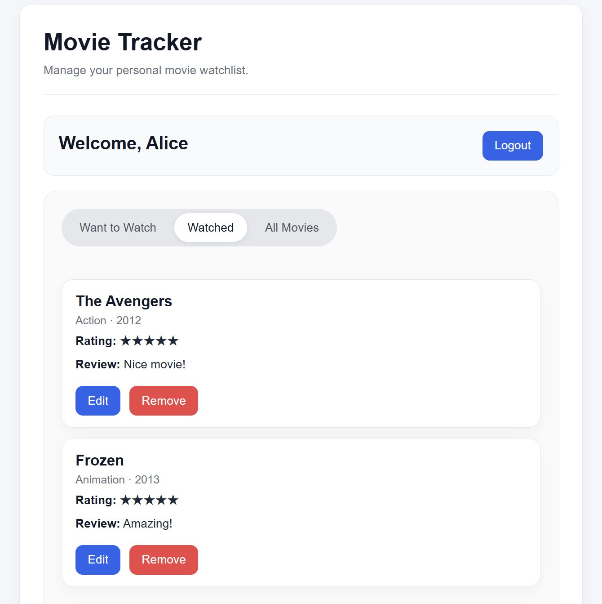

# CS5610 Project 3 - Movie Tracker
## Author

- Jikuan Wang

## Class Link

https://northeastern.instructure.com/courses/245751

## Project Objective

Build a Movie Tracker web app where users can sign up and log in, manage a watchlist and watched list, and rate and review movies. Users can also read other users’ reviews and filter movies by genre and rating to discover what to watch next. The app uses Node, Express, React with Hooks, and MongoDB (Node driver).

## Screenshot



## Design Document

[View the design document](./docs/design.md)

## Live Application

Deployed on Render:

https://movie-tracker-4eoz.onrender.com

## Instructions to build

1. Download or clone this project.

2. Open a terminal and install the backend dependencies:
   ```bash
   cd backend
   npm install
   ```

3. In the `backend` folder, create a `.env` file and add the required environment variables:
   ```env
   MONGODB_URI=your_mongodb_connection_string
   DB_NAME=movie_tracker
   PORT=3000
   ```

4. Seed the movie collection with synthetic data:
   ```bash
   npm run seed:movies
   ```

5. Start the backend server:
   ```bash
   npm run start
   ```

6. Open another terminal and install the frontend dependencies:
   ```bash
   cd frontend
   npm install
   ```

7. Start the frontend development server:
   ```bash
   npm run dev
   ```

8. Open the application in your browser at:
   ```
   http://localhost:5173
   ```

9. To create a production frontend build, run:
   ```bash
   npm run build
   ```

### Generate Seed Data

To insert synthetic movie data into MongoDB:

```bash
cd backend
npm run seed:movies
```

This script adds up to 1200 synthetic movies into the movies collection and only inserts missing records.

## How to Use

1. Open the website.  
2. If you do not have an account, register a new user account first. If you already have an account, log in.  
3. After logging in, users can browse all movies and filter movies by genre and rating.  
4. Users can read other users’ ratings and reviews to help decide what movie to watch next.  
5. Users can add new movies to the **All Movies** list.  
6. In the movie list, users can add movies to the **Want to Watch** list.  
7. Users can also type a movie name in the **Want to Watch** page to add a movie they want to watch. If the movie is not in the **All Movies** list, the user needs to enter some movie information first. After that, the movie will be automatically added to the **Want to Watch** list.  
8. After watching a movie, users can click the **Mark as Watched** button, add their rating and review, and move the movie to the **Watched** list.  

### Admin Account

The admin account has all the same functions as a normal user. In addition, the admin can edit movie information and delete movies.
