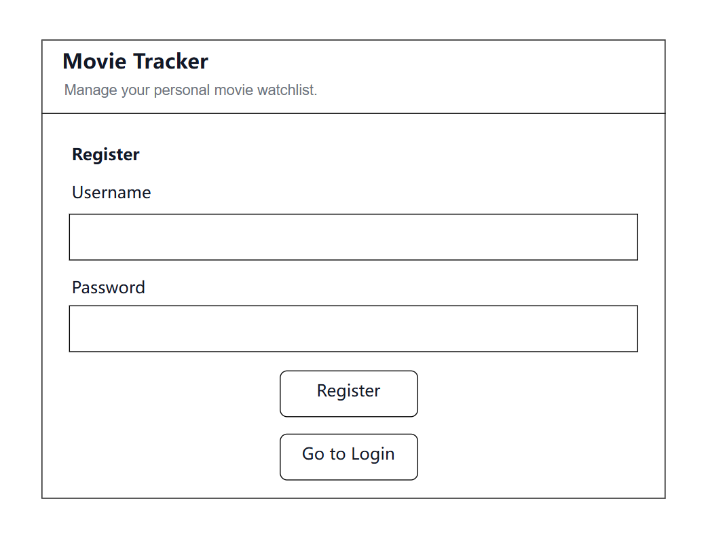
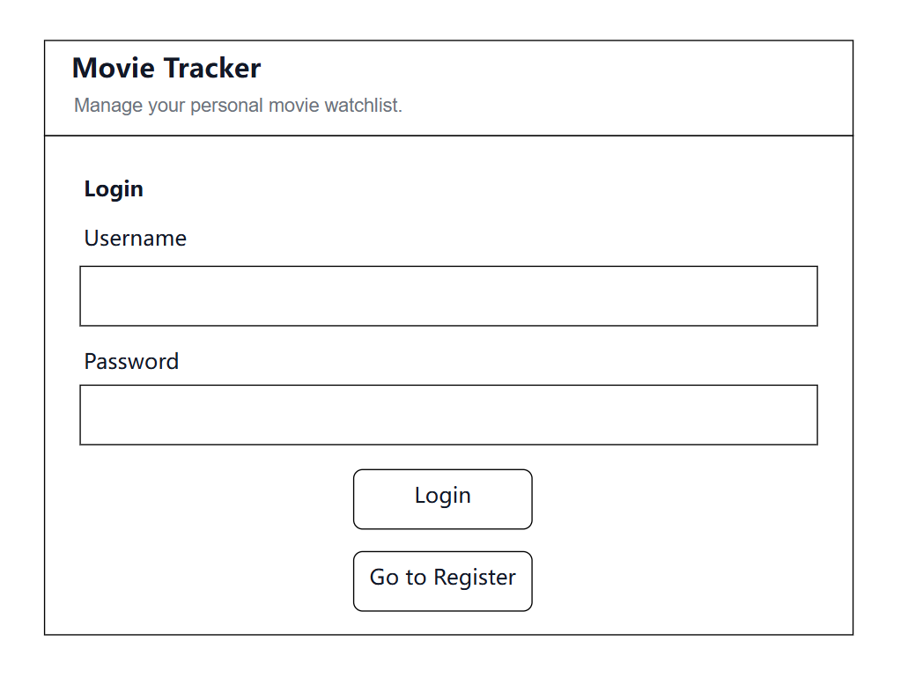
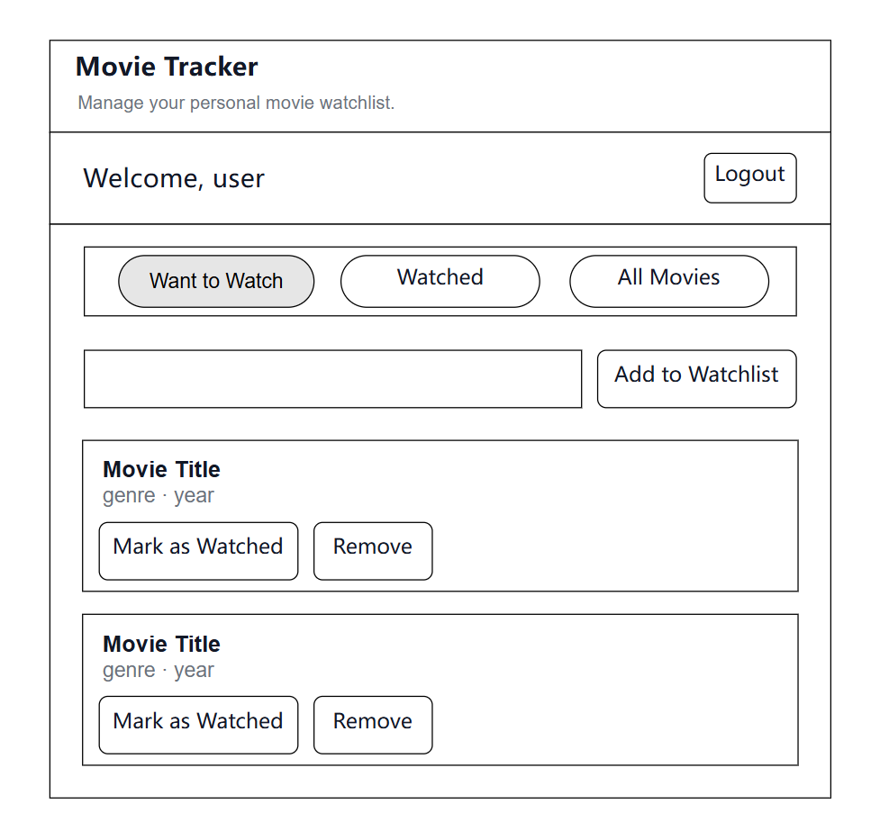
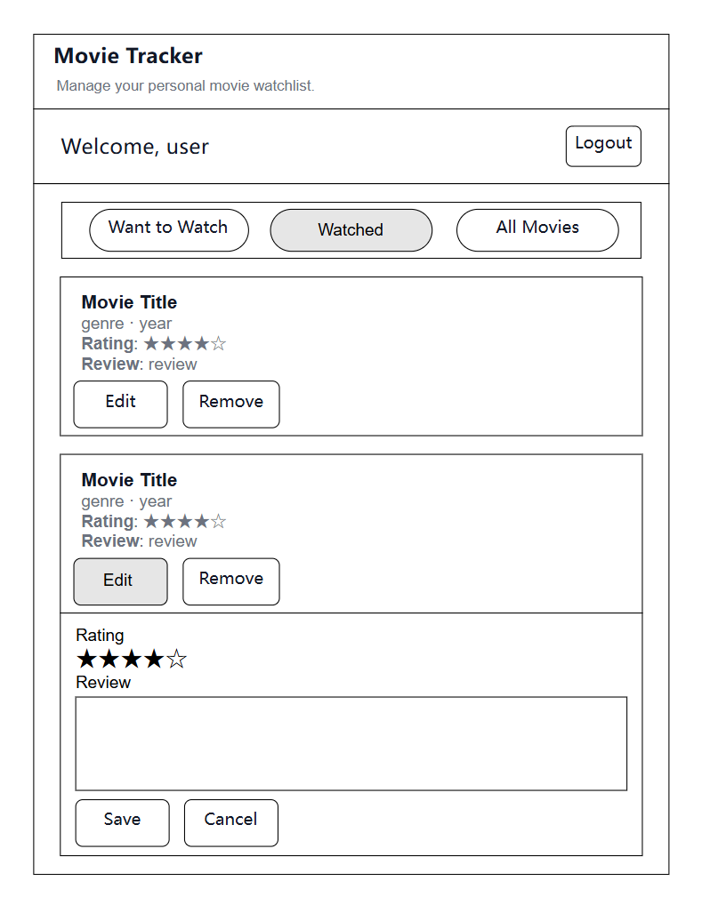
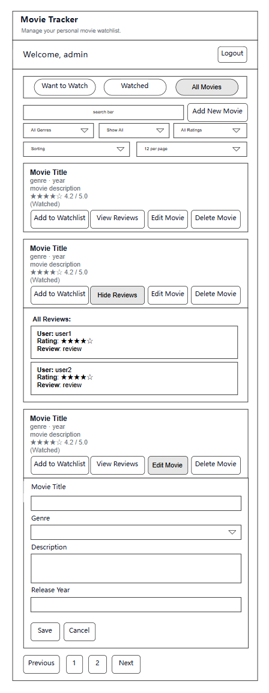
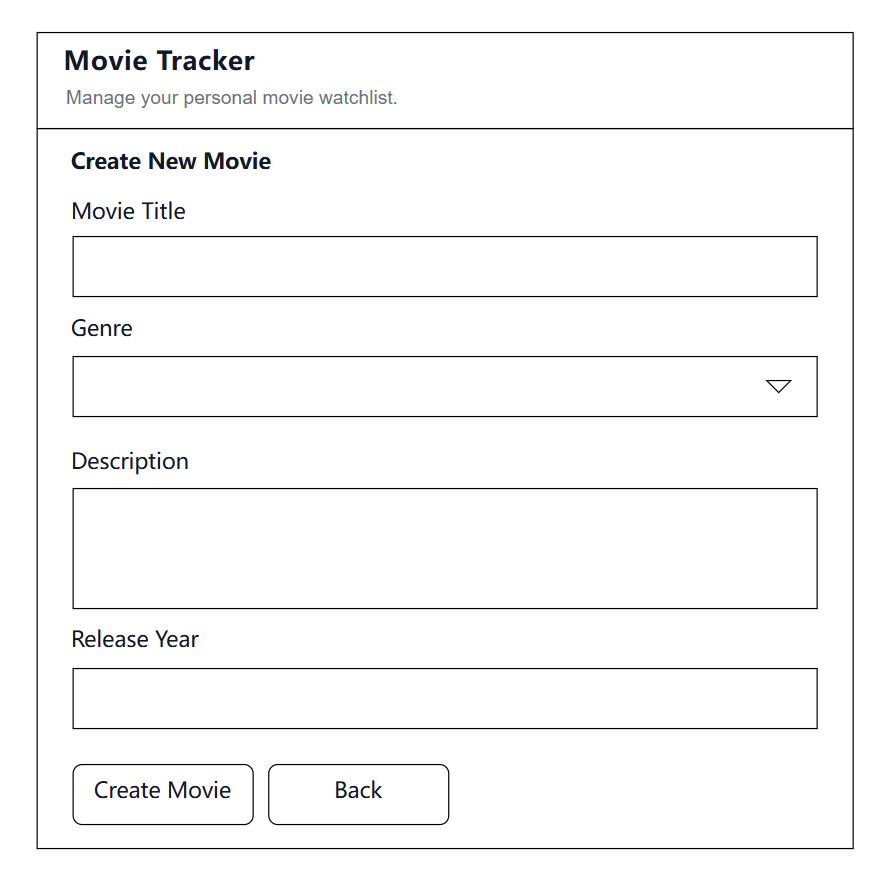

# Project Description

Movie Tracker is a web application that helps users track, manage, and discover movies. Users can sign up and log in, keep a watchlist and a watched list, and rate and review movies they have seen. Users can also read other users’ ratings and reviews, and filter movies by genre and rating to help decide what to watch next.

# User Personas

## User Persona 1

**Name:** Alice  
**Age:** 20  
**Role:** College Student

### Scenario

Alice is busy with school, but she likes watching movies in her free time. She wants a website where she can keep track of movies she wants to watch, movies she has watched, and her own ratings and reviews.

### Goals

- Keep track of movies she wants to watch
- Keep track of movies she has watched
- Save her own ratings and reviews

### Needs

- A simple page to manage movies
- A way to add movies to a watchlist and a watched list
- A way to rate movies and write reviews

### Pain Points

- It is easy to forget which movies she wanted to watch
- It is hard to remember which movies she already watched
- She has no single place to save her movie opinions

---

## User Persona 2

**Name:** Jason  
**Age:** 24  
**Role:** Movie Lover

### Scenario

Jason likes watching many kinds of movies, but he often does not know what to watch next. He wants to read other users’ ratings and reviews and use filters like genre and rating to find good movies more easily.

### Goals

- Find movies that match his interests
- Read other users’ ratings and reviews
- Use filters to choose movies faster

### Needs

- A page to view ratings and reviews from other users
- Filters for genre
- Filters for rating

### Pain Points

- There are too many movies to choose from
- It is hard to find movies that match his interests quickly
- He does not always have enough information to decide what to watch

---

## User Persona 3

**Name:** Sarah  
**Age:** 27  
**Role:** Frequent Reviewer

### Scenario

Sarah likes sharing her opinions after watching a movie. She wants to rate movies, write reviews, and read other users’ reviews so she can compare opinions and keep a record of her own thoughts.

### Goals

- Record her opinions about movies
- Post ratings and reviews
- Read and compare other users’ reviews

### Needs

- A feature to rate movies
- A feature to write reviews
- A place to read other users’ reviews
- A place to keep her own review history

### Pain Points

- She does not have one place to save her movie thoughts
- It is hard to go back and find her old reviews
- It is not easy to compare different opinions in one place

# User Stories

- As a user, I want to sign up, log in, and log out so that I can securely access and manage my account.
- As a user, I want to add movies to my watchlist so that I can save movies I want to watch later.
- As a user, I want to move movies from my watchlist to my watched list so that I can keep track of movies I have already seen.
- As a user, I want to rate and review movies so that I can record my opinions and experiences.
- As a user, I want to view other users’ ratings and reviews for a movie so that I can decide whether I want to watch it.
- As a user, I want to filter movies by genre and rating so that I can find movies that match my interests more quickly.

# Design Mockups

## Register page

## Login page

## Want to Watch page

## Watched page

## All Movies page

## Create New Movie page

